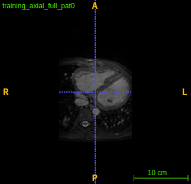

# Whole Heart MRI Segmenter

This data is from the *HVSMR 2016: MICCAI Workshop on Whole-Heart and Great Vessel Segmentation from 3D Cardiovascular MRI in Congenital Heart Disease* [challenge](http://segchd.csail.mit.edu/data.html).

This segmenting command-line tools is based on transfer learning from a  a Dense Vnet application in [NiftyNet](http://www.niftynet.io/) trained on CT data for abdominal organ segmentation.

If you want to make any changes or improvements to the config file, you can use the [NiftyNet config docs](https://niftynet.readthedocs.io/en/dev/). You can also find the source code for NiftyNet on [GitHub](https://github.com/NifTK/NiftyNet) along with other sample config files to use.

More details on the parameters in the [config file](https://niftynet.readthedocs.io/en/dev/config_spec.html#loss-type).

## Setup

First, clone this repo using:

```bash
git clone https://github.com/scouvreur/WholeHeartMRISegmenter.git
```

Then, do:

```bash
cd WholeHeartMRISegmenter/
conda create -n niftynet-dev
conda activate niftynet-dev
conda install tensorflow-gpu==1.12 yaml
pip install niftynet opencv-python scikit-image simpleitk pyyaml
```

## Data and Labels

Label | Axial | Coronal | Sagittal | Comments
:----:|:-----:|:-------:|:--------:|:--------:
n/a |  |  |  |
`A` |  |  |  | `num_classes=3`
`B` |  |  |  | `num_classes=5`

Explanation of the labels in ITKSnap:

Label | 3D View | ITKSnap Labels | Anatomincal explanation
:----:|:-------:|:--------------:|:-----------------------
`A` |  |  | <ul><li>`Label 1`: Myocardium</li><li>`Label 2`: Blood Pool and Great Vessels</li></ul>
`B` |  |  | <ul><li>`Label 1`: Myocardium</li><li>`Label 2`: Blood Pool</li><li>`Label 64`: Aorta</li><li>`Label 71`: Pulmonary Arteries</li></ul>

## Training

To start training, within the folder use:

```bash
net_segment train -c config.ini
```

It is recommended to use around `max_iter = 2000` to reach good results.

## Inference

To perform inference on the data in `testing/`, you can use:

```bash
net_segment inference -c config.ini
```

You can select the iteration checkpoint from training to perform inference on using `inference_iter`. Outputted segmentations will be placed in the directory specified in `save_seg_dir`, with the original name and the posfix specified in `output_postfix`.
